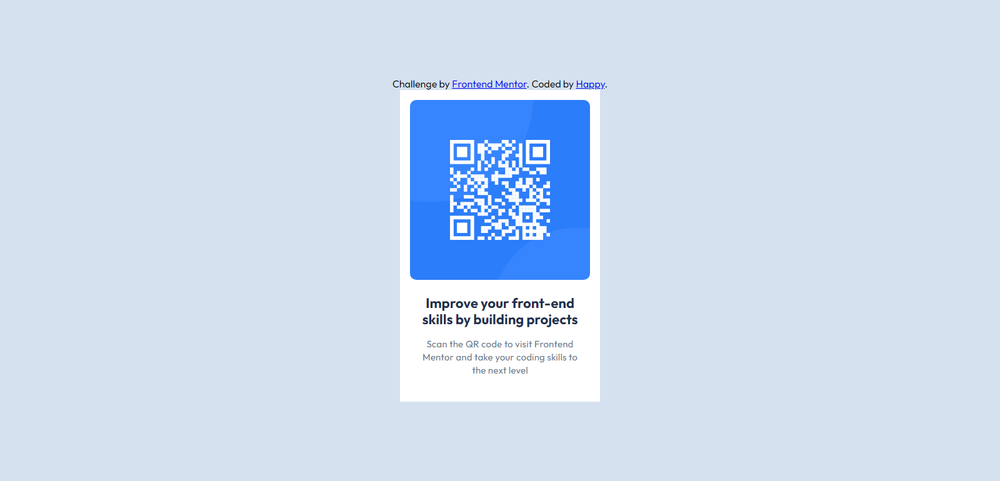

# Frontend Mentor - QR code component solution

This is a solution to the [QR code component challenge on Frontend Mentor](https://www.frontendmentor.io/challenges/qr-code-component-iux_sIO_H). Frontend Mentor challenges help you improve your coding skills by building realistic projects. 

## Table of contents

- [Overview](#overview)
  - [Screenshot](#screenshot)
  - [Links](#links)
- [My process](#my-process)
  - [Built with](#built-with)
  - [What I learned](#what-i-learned)
  - [Continued development](#continued-development)
  - [Useful resources](#useful-resources)
- [Author](#author)
- [Acknowledgments](#acknowledgments)

**Note: Delete this note and update the table of contents based on what sections you keep.**

## Overview

Challenge Overview: Building a QR code component as designed in the figma file

Introduction:
The challenge required converting a Figma design into a website, with a strong emphasis on maintaining design accuracy and attention to detail.

Objectives:
Implement the design from Figma into HTML and CSS.
Ensure the website matches the design closely and is responsive across devices.

Approach:
Reviewed the Figma design to understand its layout and styling.
Set up the project with appropriate file structure.
Coded the website, translating Figma’s design elements into HTML and CSS.
Test the site for cross-browser compatibility and responsiveness.
Refined details to ensure precision.

Outcome:

The website was created with a high level of fidelity to the Figma design.
Design elements such as typography, colors, and spacing were meticulously replicated.

### Screenshot
(../project/qr-code-project.PNG)



### Links

- Solution URL: [Add solution URL here](https://your-solution-url.com)
- Live Site URL: [Add live site URL here](https://your-live-site-url.com)

## My process

### Built with

HTML:
  Document Structure: Utilized standard HTML5 document structure including <!DOCTYPE html>, <html>, <head>, and <body> elements.
  Meta Tags: Included meta tags for character set (UTF-8) and viewport settings to ensure proper display on different devices.
  Favicon: Added a favicon for the site using a PNG image.
  External Resources: Linked to external CSS and Google Fonts.

CSS:
Custom Styles: Applied custom CSS for styling, including layout, typography, and spacing.
CSS Variables: Defined color variables for consistent color usage across the design.
Flexbox: Used Flexbox for aligning and centering content within the container.
Utility Classes: Implemented utility classes for padding and text styling (.padding-200, .text-preset-1, .text-preset-2).

Fonts:
  Google Fonts: Included the 'Outfit' font from Google Fonts to style the text with a specific font-family and weight range.

Images:
  QR Code Image: Added an image of a QR code with appropriate alt text for accessibility.

Responsive Design:
  Viewport Meta Tag: Ensured the site is responsive and displays correctly on various devices by using the viewport meta tag.

Attribution:
  Credits: Included attribution for the challenge and coder using anchor (<a>) elements.


### What I learned

Use this section to recap over some of your major learnings while working through this project. Writing these out and providing code samples of areas you want to highlight is a great way to reinforce your own knowledge.

To see how you can add code snippets, see below:

```html
<h1>Some HTML code I'm proud of</h1>
```
```css
.proud-of-this-css {
  color: papayawhip;
}
```
```js
const proudOfThisFunc = () => {
  console.log('🎉')
}
```

If you want more help with writing markdown, we'd recommend checking out [The Markdown Guide](https://www.markdownguide.org/) to learn more.

**Note: Delete this note and the content within this section and replace with your own learnings.**

### Continued development

Use this section to outline areas that you want to continue focusing on in future projects. These could be concepts you're still not completely comfortable with or techniques you found useful that you want to refine and perfect.

**Note: Delete this note and the content within this section and replace with your own plans for continued development.**

### Useful resources

- [Example resource 1](https://www.example.com) - This helped me for XYZ reason. I really liked this pattern and will use it going forward.
- [Example resource 2](https://www.example.com) - This is an amazing article which helped me finally understand XYZ. I'd recommend it to anyone still learning this concept.

**Note: Delete this note and replace the list above with resources that helped you during the challenge. These could come in handy for anyone viewing your solution or for yourself when you look back on this project in the future.**

## Author

- Website - [Add your name here](https://www.your-site.com)
- Frontend Mentor - [@yourusername](https://www.frontendmentor.io/profile/yourusername)
- Twitter - [@yourusername](https://www.twitter.com/yourusername)

**Note: Delete this note and add/remove/edit lines above based on what links you'd like to share.**

## Acknowledgments

This is where you can give a hat tip to anyone who helped you out on this project. Perhaps you worked in a team or got some inspiration from someone else's solution. This is the perfect place to give them some credit.

**Note: Delete this note and edit this section's content as necessary. If you completed this challenge by yourself, feel free to delete this section entirely.**
